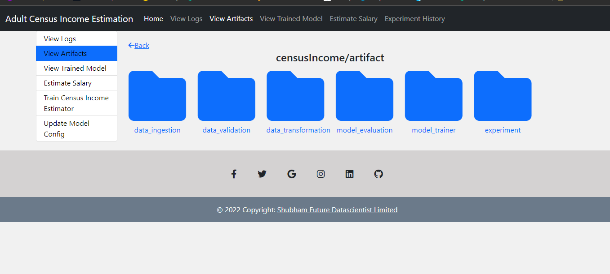

# Adult Census Income Prediction
- Adult Census Income Is a classification Problem in which we need to identify wether a person is earning more than Fifty Thousand Doller or not.
- Adult Census Income prediction is based on data collected by Ronny Kohavi and Barry Becker (Data Mining and Visualization, Silicon Graphics).
- This data has extracted from the 1994 Census bureau database.
- It is a Classification Problem so best model such as Random Forest Classifier , Logistic Regression used as a final Model for Prediction. 
- Parameter update feature given with model and validation data downloading is possible.
- In this Project we Perform CI/CD pipeline to automated the Process of Deployment on Heroku Cloud Platform.

## Screenshots

- Home Page

.png)
.png)

- Trainned Model Page

.png)

- Income Prediction Page

.png)
.png)

- View Artifact Page



- Update Model Config

.png)

## Features
- Trained Model Downloading Available
- Preprocessed Data can be downloaded
- Model can re Tune with user given parameters
- Data Drift can be compare using proper Graphs
- use Can estimate and Predict output

## Installation

Install my-project with cmd
- Download code from this directory
- Past it in your system and extract it
- cd to the directory where requirements.txt is located
- Activate your virtualenv
```cmd
    conda activate venv/
```
- Install requirements.txt
```cmd
     pip install setup.py
     pip install -r requirements.txt
```
- Run run.py file in cmd
```cmd
    python app.py
```

## Deployment
- Used CI/CD Pipeline for deployment over Heruko cloud platform
- To maintain website we used Docker.

## Deployment Link
- [Deploy Link](https://adult-census-income-predictor.herokuapp.com)
- [YouTube Video](https://youtu.be/zBoPRGbZruM)
- [Linkdin Profile](https://www.linkedin.com/in/shubham-rawat-8687111a1/)

## 🛠 Skills
Python, Flask, HTML, Bootstrap, Git, Docker, Machine Learning (ML), Numpy, Pandas, Visualization
